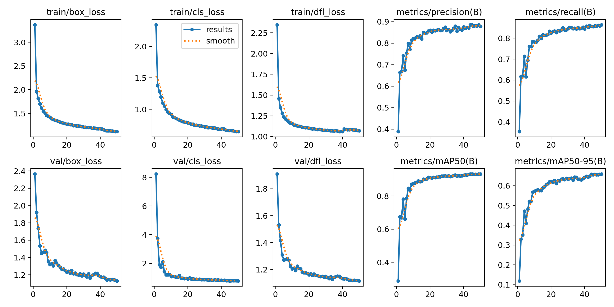

# Tree Disease Detection using YOLOv8

[](https://opensource.org/licenses/MIT)
[](https://www.python.org/downloads/)
[](https://colab.research.google.com/github/Ismat-Samadov/crop_desease_detection/blob/main/crop_desease_detection.ipynb)
[](https://huggingface.co/IsmatS/crop_desease_detection)
[](https://huggingface.co/spaces/IsmatS/tree-disease-detector-demo)

A deep learning project for detecting unhealthy/diseased trees in aerial UAV imagery using YOLOv8s architecture. This model achieves 93.3% mAP50 on the PDT (Pests and Diseases Tree) dataset.



## 🚀 Quick Links

- 🤗 **[Interactive Demo on Hugging Face Spaces](https://huggingface.co/spaces/IsmatS/tree-disease-detector-demo)**
- 🤗 **[Model on Hugging Face Hub](https://huggingface.co/IsmatS/crop_desease_detection)**
- 📓 **[Google Colab Notebook](https://colab.research.google.com/github/Ismat-Samadov/crop_desease_detection/blob/main/crop_desease_detection.ipynb)**

## 🎯 Try It Now!

Experience the model in action with our interactive demo:

<div align="center">
  <a href="https://huggingface.co/spaces/IsmatS/tree-disease-detector-demo">
    
  </a>
</div>

## 📊 Model Performance

| Metric | Value |
|--------|-------|
| mAP50 | 0.933 |
| mAP50-95 | 0.659 |
| Precision | 0.878 |
| Recall | 0.863 |
| Training Time | 24.5 minutes |
| Device | NVIDIA A100-SXM4-40GB |

## 🌟 Features

- High-accuracy detection of unhealthy trees in aerial imagery
- Optimized for UAV/drone captured images at 640x640 resolution
- Fast inference (~7ms per image on GPU)
- Pre-trained model available on [Hugging Face](https://huggingface.co/IsmatS/crop_desease_detection)
- Interactive web demo on [Hugging Face Spaces](https://huggingface.co/spaces/IsmatS/tree-disease-detector-demo)

## 📁 Project Structure

```
crop_desease_detection/
├── crop_desease_detection.ipynb  # Main training notebook
├── crop_desease_detection.py     # Python implementation
├── training_results.png          # Model performance visualization
├── research.txt                  # Dataset research and references
├── LICENSE                       # MIT License
└── README.md                     # This file
```

## 🚀 Quick Start

### Installation

```bash
pip install ultralytics torch torchvision opencv-python matplotlib
```

### Using the Pre-trained Model

You can load the model directly from Hugging Face:

```python
from ultralytics import YOLO

# Load model from Hugging Face
model = YOLO('https://huggingface.co/IsmatS/crop_desease_detection/resolve/main/best.pt')

# Or use the model ID
model = YOLO('IsmatS/crop_desease_detection')

# Run inference
results = model('path/to/your/image.jpg')

# Process results
for result in results:
    boxes = result.boxes
    if boxes is not None:
        for box in boxes:
            confidence = box.conf[0]
            bbox = box.xyxy[0]
            print(f"Unhealthy tree detected with {confidence:.2f} confidence")

# Save annotated image
results[0].save('result.jpg')
```

### Web Interface

For a user-friendly interface, visit our [Hugging Face Space](https://huggingface.co/spaces/IsmatS/tree-disease-detector-demo) where you can:
- Upload images directly
- Adjust detection thresholds
- Visualize results instantly
- Download annotated images

### Training from Scratch

1. Clone the repository:
```bash
git clone https://github.com/Ismat-Samadov/crop_desease_detection.git
cd crop_desease_detection
```

2. Run the training notebook:
```bash
jupyter notebook crop_desease_detection.ipynb
```

Or use Google Colab:
[](https://colab.research.google.com/github/Ismat-Samadov/crop_desease_detection/blob/main/crop_desease_detection.ipynb)

## 📊 Dataset

This model was trained on the [PDT (Pests and Diseases Tree) dataset](https://huggingface.co/datasets/qwer0213/PDT_dataset):

- **Training Images**: 4,536
- **Validation Images**: 567
- **Test Images**: 567
- **Resolution**: 640x640 pixels
- **Classes**: 1 (unhealthy trees)

### Dataset Statistics

| Split | Images | Labels | Backgrounds |
|-------|--------|--------|-------------|
| Train | 4,536  | 3,206  | 1,330      |
| Val   | 567    | 399    | 168        |
| Test  | 567    | 390    | 177        |

## 🏗️ Model Architecture

- **Base Model**: YOLOv8s
- **Input Size**: 640x640 pixels
- **Parameters**: 11.1M
- **GFLOPs**: 28.6
- **Layers**: 129

The trained model is available on [Hugging Face Model Hub](https://huggingface.co/IsmatS/crop_desease_detection).

### Training Configuration

```yaml
epochs: 50
batch_size: 16
optimizer: SGD
learning_rate: 0.01
momentum: 0.9
weight_decay: 0.001
device: CUDA (NVIDIA A100-40GB)
```

## 📈 Results

The model achieved excellent performance on the validation set:

- Fast convergence: reached 0.878 precision by epoch 13
- Stable training: consistent improvement without overfitting
- High accuracy: 93.3% mAP50 on validation data

View training results and performance metrics on our [Hugging Face Model Card](https://huggingface.co/IsmatS/crop_desease_detection).

## 🔧 Advanced Usage

### Custom Inference Settings

```python
# Adjust detection parameters
results = model.predict(
    source='path/to/image.jpg',
    conf=0.25,  # Confidence threshold
    iou=0.45,   # IoU threshold for NMS
    imgsz=640,  # Inference size
    save=True   # Save results
)
```

### Batch Processing

```python
import glob

# Process multiple images
image_paths = glob.glob('path/to/images/*.jpg')
results = model(image_paths, batch=8)

# Process results
for i, result in enumerate(results):
    print(f"Image {i}: Detected {len(result.boxes)} unhealthy trees")
    result.save(f'result_{i}.jpg')
```

### API Usage

You can also use the model through the Hugging Face Inference API:

```python
import requests

API_URL = "https://api-inference.huggingface.co/models/IsmatS/crop_desease_detection"
headers = {"Authorization": "Bearer YOUR_HF_TOKEN"}

def query(filename):
    with open(filename, "rb") as f:
        data = f.read()
    response = requests.post(API_URL, headers=headers, data=data)
    return response.json()

output = query("your_image.jpg")
```

## 🌐 Applications

- **Precision Agriculture**: Early detection of diseased trees in orchards
- **Forest Management**: Large-scale monitoring of forest health
- **Environmental Monitoring**: Tracking disease spread patterns
- **Research**: Studying tree disease progression

## 🤝 Contributing

Contributions are welcome! Please feel free to submit a Pull Request.

1. Fork the project
2. Create your feature branch (`git checkout -b feature/AmazingFeature`)
3. Commit your changes (`git commit -m 'Add some AmazingFeature'`)
4. Push to the branch (`git push origin feature/AmazingFeature`)
5. Open a Pull Request

## 📄 License

This project is licensed under the MIT License - see the [LICENSE](LICENSE) file for details.

## 🙏 Acknowledgments

- [PDT Dataset](https://huggingface.co/datasets/qwer0213/PDT_dataset) by Zhou et al., ECCV 2024
- [Ultralytics YOLOv8](https://github.com/ultralytics/ultralytics) framework
- Training performed on Google Colab with NVIDIA A100 GPU
- Model hosted on [Hugging Face](https://huggingface.co/IsmatS/crop_desease_detection)
- Demo hosted on [Hugging Face Spaces](https://huggingface.co/spaces/IsmatS/tree-disease-detector-demo)

## 📚 Citation

If you use this model in your research, please cite:

```bibtex
@software{samadov2024treedisease,
  author = {Ismat Samadov},
  title = {Tree Disease Detection using YOLOv8},
  year = {2024},
  publisher = {GitHub},
  url = {https://github.com/Ismat-Samadov/crop_desease_detection}
}

@inproceedings{zhou2024pdt,
  title={PDT: Uav Target Detection Dataset for Pests and Diseases Tree},
  author={Zhou, Mingle and Xing, Rui and others},
  booktitle={ECCV},
  year={2024}
}
```

## 📞 Contact

Ismat Samadov - [GitHub](https://github.com/Ismat-Samadov)

Project Link: [https://github.com/Ismat-Samadov/crop_desease_detection](https://github.com/Ismat-Samadov/crop_desease_detection)

## 🔗 Important Links

- 🤗 **Model**: [https://huggingface.co/IsmatS/crop_desease_detection](https://huggingface.co/IsmatS/crop_desease_detection)
- 🚀 **Demo**: [https://huggingface.co/spaces/IsmatS/tree-disease-detector-demo](https://huggingface.co/spaces/IsmatS/tree-disease-detector-demo)
- 💻 **GitHub**: [https://github.com/Ismat-Samadov/crop_desease_detection](https://github.com/Ismat-Samadov/crop_desease_detection)
- 📊 **Dataset**: [https://huggingface.co/datasets/qwer0213/PDT_dataset](https://huggingface.co/datasets/qwer0213/PDT_dataset)
- 📓 **Colab**: [Open in Google Colab](https://colab.research.google.com/github/Ismat-Samadov/crop_desease_detection/blob/main/crop_desease_detection.ipynb)
